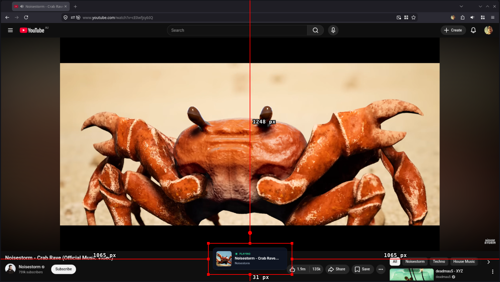

# D-Bus Music OBS Overlay

A modern, glassmorphic OBS Studio browser overlay that dynamically displays currently playing media from KDE Plasma (and other Linux environments) via MPRIS over D-Bus. 

The overlay runs a local, lightweight Python server using FastAPI and WebSockets, connecting directly to your active media players (like Spotify, Firefox, VLC, or Plasma Browser Integration). When music plays, a sleek UI card smoothly slides onto your OBS stream. When playback stops, it disappears cleanly.



## Features
- **Real-time Updates**: Powered by D-Bus and WebSockets for instant metadata changes.
- **Glassmorphic Design**: Clean UI with backdrop blurring, responsive layout, and beautiful transitions (built with Tailwind CSS).
- **MPRIS Support**: Works natively with the Linux desktop standard (no need for specific platform API keys).
- **Auto-Hide**: Automatically hides when media is paused or stopped to keep your stream uncluttered.

## Requirements
- Python 3.10+
- A Linux environment with an active D-Bus session and an MPRIS-compatible media player (e.g., KDE Plasma, GNOME, etc.)
- KDE Plasma Integration browser extension (Or similar rich media playback reporting extension for your browser)

## Installation

The recommended way to install and run the application is using [pipx](https://pipx.pypa.io/stable/). `pipx` installs Python CLI tools into isolated environments, preventing dependency conflicts.

You can install it directly from the GitHub repository:

```bash
pipx install git+https://github.com/andrew-stclair/dbus-music-overlay.git
```

### Upgrading
To pull the latest changes in the future, simply run:
```bash
pipx upgrade dbus-music-overlay
```

## Usage

1. Start the overlay server by running the command in your terminal:
   ```bash
   dbus-music-overlay
   ```
   *(It will start a local server on `http://localhost:8000`)*

2. Open **OBS Studio**.
3. Under your desired scene, add a new **Browser Source**.
4. Set the **URL** to: `http://localhost:8000`
5. Set the **Width** to `430` and **Height** to `160` (or leave it at default, it will scale).
6. **Important**: Delete any text inside the "Custom CSS" box in OBS to ensure the transparent background works correctly.
7. Play music on your PC. The overlay should appear instantly in OBS!

## Development Setup

If you want to modify the project locally:

```bash
git clone https://github.com/andrew-stclair/dbus-music-overlay.git
cd dbus-music-overlay
uv pipx install -e .
```

Then you can run `dbus-music-overlay` to test your changes.
